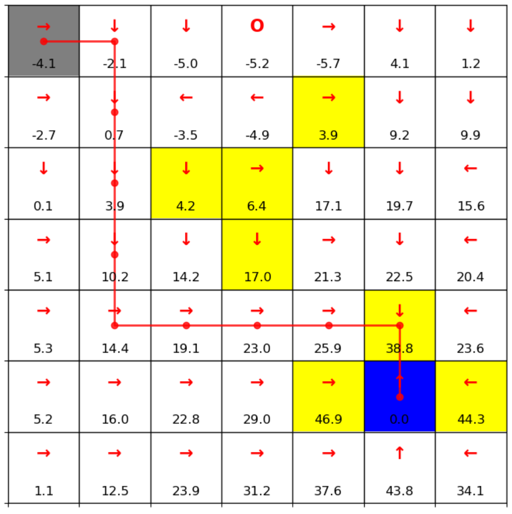

# Reinforcement-Learning-Basic-Algorithms
I would like to express my sincere gratitude to ***Prof. Shiyu Zhao*** (Westlake University) for the course ***Mathematical Principles of Reinforcement Learning*** and to ***Prof. Weinan Zhang*** for ***Hands-on Reinforcement Learning***. Both have profoundly inspired and shaped my systematic study of reinforcement learning.

###  GridWorld Environment (for notebooks **2–8**)

The algorithms in notebooks **2–8** are implemented in a custom **7×7 GridWorld** environment.

**Environment details:**
- The grid includes **one start state**, **one goal state**, and **several forbidden states**.  
- The agent aims to find an **optimal policy** that maximizes the total return (sum of discounted rewards).  
- **Rewards and penalties:**
  - Each step incurs a **−1** penalty.  
  - Reaching the goal gives an additional **+50** reward.  
  - Hitting a wall or entering a forbidden cell gives an additional **−10** penalty.  
- **Action stochasticity:**
  - Each chosen action is executed correctly with **80%** probability,  
    deviates **10% left**, and **10% right**.  
  - Action **4 (stay)** means the agent remains in the same state.

This setup allows testing algorithms such as Monte Carlo, SARSA, Q-Learning, and DQN within a discrete and interpretable environment.

---

###  CartPole Environment (for notebook **9**)

The algorithm in notebook **9** is implemented in the **CartPole-v0** environment from **OpenAI Gym**.

---

###  Inverted Pendulum (for notebook **10**)
The algorithm in notebook **10** is implemented in the **Pendulum-v1** environment from **OpenAI Gym**.

---

###  Summary

| Notebook ID | Algorithm Environment | Description |
|--------------|-----------------------|--------------|
| 2–8 | **GridWorld** | Tabular RL algorithms (MC, SARSA, Q-Learning, etc.) |
| 9 | **CartPole-v0** | Deep Q-Network (DQN) implementation |
| 10 | **Pendulum-v1** | DoubleDQN implementation |